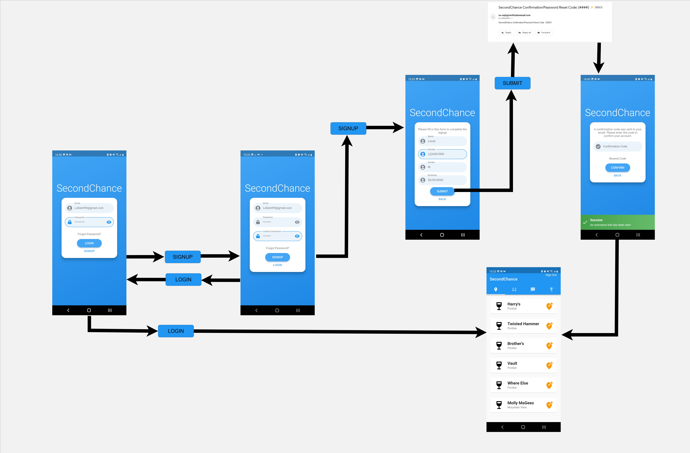
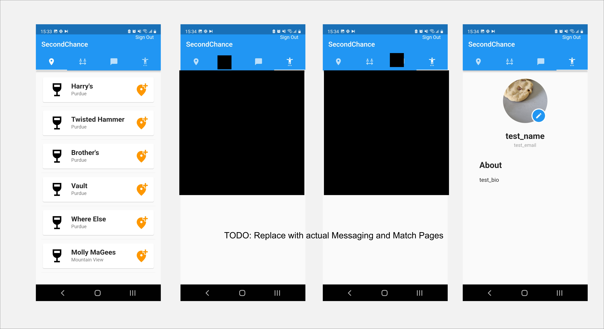
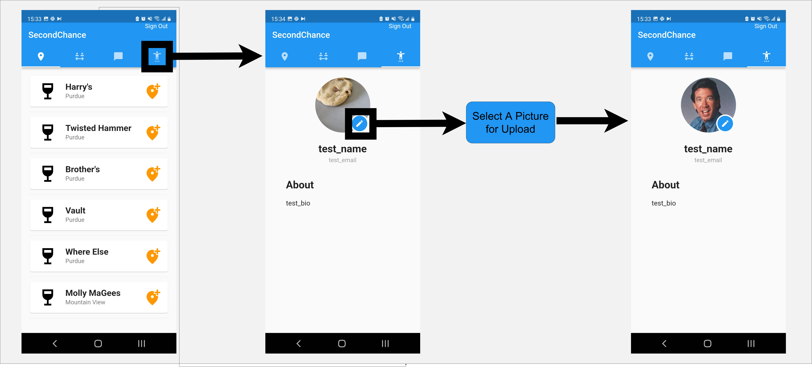

# Welcome to SecondChance

## Table of Contents
* [User Manual](#manual)
   * [Account Creation](#account_creation)
   * [App Navigation](#app_navigation)
   * [Editing your Profile](#editting_profile)
   * [Matching](#matching)
* [Support](#support)

## User Manual 

### Account Creation / Login 
1. Put in your email for your username. Note: only 1 account per email is allowed in the system
2. Create your password.  8 charaters minimum, 1 number, 1 uppercase, 1 lowercase, and 1 symbol minimum   
3. If creating a new account, click **Sign Up** and verify your password.  If logging in, press login and you are finished!   
4. Continue to input the information requested   
5. You will recieve a verification email in your inbox, input the code to complete signup!         

### App Navigation     
Currently we have 4 main tabs, from left to right    
* Location List, think bars and restaurants.  Here you can click on a location and see users who were also here, currently this just displays all users   
  * Under this is the nested user page listing all users, besides yourself.  On this screen you can click to view a certain user's profile.    
    * Upon clicking to view a Profile, like the following one, you will see a match status button, matching is talked about more in depth [here](#matching)    
* Match Listing, Your current matches, outgoing and incoming included.  _currently functional but not pictured_
* Messaging, Non-functional messaging with your matches _currently **NOT** functional and not pictured_    
* Your Profile      

### Editing your Profile     
Currently, we only support editting your profile picture by clicking the small pencil icon by your picture.  In the future the information will be relevant and you will be able to update your information here    

### Matching 
Our matching system consists of 4 seperate states.
1. Not Matched - Your default state with any user.  No connection between you two has been made    
2. Pending Match, Outgoing - You have requested a match with this user.  You can either rescend the request or wait for them to accept    
3. Pending Match, Incoming - You have recieved a match from this user.  You can either leave it pending and not accept, not creating a match, or you can accept and create a match with this user.    
4. Currently Matched - You are matched with this user.  In the future you will be able to message and exchange information    

#### Sending/Accepting Matches Workflow 

#### Removing Matches Workflow

## Support and Bug Reporting 

Having issues with the App?  Check out our [current issues](https://github.com/OSS-Second-Chance/SecondChance_Org/issues) to look for a possible solution or to report the bug!

